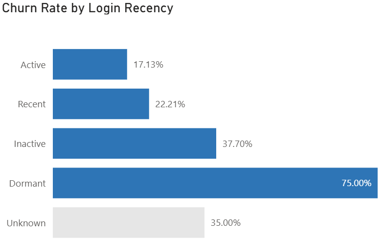
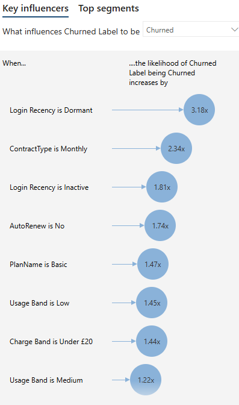
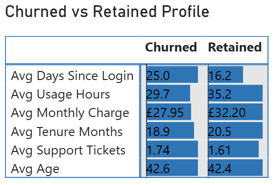
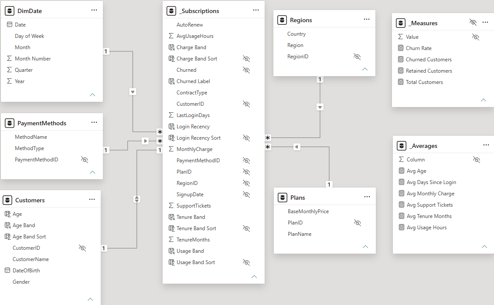

# Novastream Customer Churn Analysis

A Power BI churn analysis built from raw subscription tables, covering the cleaning, the
dimensional model, the DAX and the business reading.

> Overall churn is **23.9%**. Customers who have gone dormant churn at **75%**, more than
> four times the active rate of 17.1%. Contract type and auto-renew move churn hard.
> Region, payment method and gender do not move it at all.

## Findings

### Login recency is the strongest single signal

Active 17.1%, recent 22.2%, inactive 37.7%, dormant 75.0%. Recency is also actionable in
a way that demographics are not: a customer drifting from recent to inactive is visible
weeks before they cancel.

### Commitment matters more than price

Monthly contracts churn at 29.9% against 12.8% on annual. Auto-renew off churns at 31.2%
against 17.9% on. Basic plan customers churn at 29.1% against 17.4% on Premium, which
reads less as a price effect than as a commitment one, since Basic and monthly overlap.

Power BI's key influencers agrees with the manual cuts and ranks them: dormant login
recency raises the likelihood of churn 3.18 times, monthly contract 2.34 times, inactive
recency 1.81 times, auto-renew off 1.74 times.

### The churned and retained profiles are closer than expected

Churned customers average 25.0 days since last login against 16.2 for retained, and 29.7
usage hours against 35.2. But average age is 42.6 against 42.4, and support tickets 1.74
against 1.61. Engagement separates the groups. Demographics and complaint volume barely
do.

### What does not move churn

Region ranges only from 21.9% to 25.0%, payment method from 23.1% to 24.2%, and gender
from 23.4% to 24.4%, against an overall rate of 23.9%. Reporting that a factor is flat
is as useful as reporting one that is not, because it stops effort being spent there.

## Data preparation

The raw tables were not analysis-ready. What had to be fixed:

- **260 missing values** across the subscription and customer tables
- **Monthly charge stored as text** in 60 rows, which silently breaks any aggregation
- **35 duplicate rows**
- **9 orphan foreign keys**, subscriptions pointing at customers that do not exist
- **5 impossible outliers**

The cleaning changes the headline. The raw tables read 22.8% churn; the cleaned tables
read 23.9%. A whole percentage point sat in duplicates and broken joins.

## The model

A star schema with `_Subscriptions` as the fact table, filtered by `Customers`, `Plans`,
`Regions`, `PaymentMethods` and a `DimDate` table. Measures are grouped into `_Measures`
and `_Averages` tables so report users work with measures rather than raw columns.

Banding columns such as login recency, tenure band, usage band, charge band and age band
are built in the model rather than in visuals, so every chart cuts the data the same way.

## Recommendations

1. **Trigger on recency, not on cancellation.** A customer crossing from recent to
   inactive is the point of intervention. Waiting for a cancellation is waiting too long.
2. **Target auto-renew off and monthly together.** They overlap, and both carry roughly
   30% churn.
3. **Do not spend on region, payment method or gender segmentation.** The data says there
   is nothing there.

## Limitations

- The dormant band is small, 12 customers, so 75% is directional rather than precise.
- Key influencers reports association, not causation, and the inputs correlate with one
  another.
- There is no price-change or competitor context, so a cancellation cannot be attributed
  to a reason.

## Repository contents

- `Capstone.pbix` the Power BI model, measures and report
- `Capstone_January_Sambrook.pptx` the presented findings
- `images/` report screenshots used above

The source dataset is course material and is not redistributed here.

## Assessment

Submitted as a course capstone and assessed at **Distinction, 89 / 100**. Every headline
figure was independently recomputed by the assessor and verified within tolerance:
overall churn 23.90% against 23.82%, average monthly charge and average tenure both
exact, and every segment rate matching.

Two cleaning decisions were singled out as strengths rather than deviations. The five
impossible outlier cells were nulled while keeping their rows, and the nine orphan
foreign keys were routed to an explicit Unknown member rather than deleted, so those
customers stay visible and labelled instead of disappearing into a blank. The assessor
noted this is arguably better than removing them.

The marks lost were evidential rather than analytical: a Power Query Applied Steps
screenshot, a standalone churn-by-plan visual, and a named Total MRR measure.

---

Built by January Sambrook
